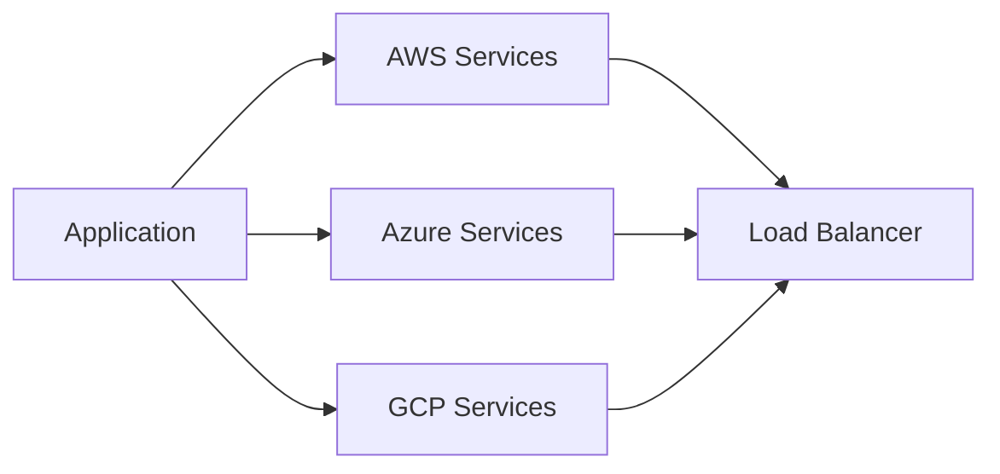

# Cloud Solutions

## ☁️ Comprehensive Cloud Services

ITMC Cloud provides end-to-end cloud solutions that help businesses leverage the full power of cloud computing. Whether you're just starting your cloud journey or looking to optimize existing infrastructure, we have you covered.

## 🚀 Cloud Migration Services

### Assessment & Planning
We analyze your current infrastructure and create a detailed migration roadmap.

- Infrastructure audit
- Cost analysis and optimization
- Risk assessment
- Migration strategy development

### Migration Execution
Our team handles the entire migration process with minimal disruption.

- Phased migration approach
- Data migration and validation
- Application modernization
- Testing and validation

### Post-Migration Support
We ensure your cloud environment runs smoothly after migration.

- Performance optimization
- Cost monitoring
- Security hardening
- Team training

## 🏗️ Cloud Architecture Design

### Multi-Cloud Solutions


### Key Features
- High availability design
- Disaster recovery planning
- Auto-scaling configurations
- Cost-optimized architectures

## 🔧 Infrastructure Services

### Platform Offerings

=== "AWS"
    - EC2, ECS, EKS
    - Lambda & Serverless
    - S3, RDS, DynamoDB
    - CloudFormation & Terraform
    - VPC & Network Design

=== "Azure"
    - Virtual Machines & App Services
    - Azure Functions
    - Azure SQL, CosmosDB
    - ARM Templates & Bicep
    - Azure DevOps Integration

=== "GCP"
    - Compute Engine & GKE
    - Cloud Functions
    - Cloud SQL, Firestore
    - Deployment Manager
    - Cloud Build & CI/CD

## 🛡️ Security & Compliance

### Security Best Practices
- Identity and Access Management (IAM)
- Network security and firewalls
- Encryption at rest and in transit
- Security monitoring and logging
- Vulnerability assessments

### Compliance Standards
We ensure your infrastructure meets industry standards:

- SOC 2
- ISO 27001
- HIPAA
- GDPR
- PCI DSS

## 📊 Monitoring & Optimization

### Performance Monitoring
```yaml
Monitoring Stack:
  - Prometheus: Metrics collection
  - Grafana: Visualization
  - ELK Stack: Log aggregation
  - CloudWatch/Azure Monitor: Cloud-native monitoring
```

### Cost Optimization
- Resource right-sizing
- Reserved instances & savings plans
- Unused resource cleanup
- Cost allocation and tracking

## 🌐 Networking Solutions

### Global Infrastructure
- Multi-region deployments
- Content Delivery Networks (CDN)
- Global load balancing
- Low-latency configurations

### Hybrid Cloud
- VPN and Direct Connect setups
- On-premise integration
- Hybrid storage solutions
- Consistent management across environments

## 📈 Scalability & Performance

!!! example "Auto-Scaling Example"
    ```yaml
    scaling_policy:
      min_instances: 2
      max_instances: 10
      target_cpu: 70%
      target_memory: 80%
      scale_up_cooldown: 300s
      scale_down_cooldown: 600s
    ```

## 💰 Pricing Models

We offer flexible pricing to suit your needs:

| Model | Description | Best For |
|-------|-------------|----------|
| Project-Based | Fixed scope and price | Well-defined projects |
| Time & Materials | Pay for actual time | Evolving requirements |
| Managed Services | Monthly retainer | Ongoing support |
| Pay-as-You-Go | Infrastructure costs + margin | Variable workloads |

## 🎯 Case Studies

### E-Commerce Platform Migration
**Challenge**: Migrate high-traffic e-commerce platform to AWS  
**Solution**: Implemented containerized microservices on EKS  
**Result**: 99.99% uptime, 40% cost reduction, 3x faster deployments

### FinTech Application Modernization
**Challenge**: Modernize legacy banking application  
**Solution**: Built cloud-native architecture on Azure  
**Result**: Improved security, regulatory compliance, scalable infrastructure

## 🔗 Related Resources

- [Development Services](development.md)
- [DevOps Snippets](../snippets/devops.md)
- [Getting Started Guide](../guides/getting-started.md)

---

Ready to move to the cloud? [Contact us](../about.md#get-in-touch) to discuss your project!
