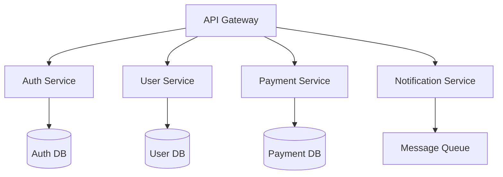

# Software Development Services

## 💻 Custom Software Development

At ITMC Cloud, we build high-quality, scalable software solutions tailored to your business needs. From web applications to microservices, we deliver excellence at every stage.

## 🎯 Development Specializations

### Web Application Development
Modern, responsive web applications built with cutting-edge technologies.

#### Frontend Technologies
- **React.js**: Component-based UIs with hooks and modern patterns
- **Vue.js**: Progressive framework for building user interfaces
- **Angular**: Full-featured framework for enterprise applications
- **Next.js**: Server-side rendering and static site generation
- **TypeScript**: Type-safe JavaScript for robust applications

#### Backend Technologies
- **Node.js**: Fast, scalable server-side JavaScript
- **Python (Django/Flask/FastAPI)**: Robust web frameworks
- **Java (Spring Boot)**: Enterprise-grade applications
- **Go**: High-performance microservices
- **.NET Core**: Cross-platform development

### Mobile Development
=== "Native"
    - iOS (Swift)
    - Android (Kotlin)

=== "Cross-Platform"
    - React Native
    - Flutter
    - Ionic

## 🏗️ Architecture Patterns

### Microservices Architecture


### Serverless Applications
```python
# Example AWS Lambda Function
import json
import boto3

def lambda_handler(event, context):
    """
    Process incoming events and trigger actions
    """
    dynamodb = boto3.resource('dynamodb')
    table = dynamodb.Table('users')
    
    # Process event data
    user_data = json.loads(event['body'])
    
    # Store in DynamoDB
    response = table.put_item(Item=user_data)
    
    return {
        'statusCode': 200,
        'body': json.dumps({'message': 'Success'})
    }
```

## 🔄 Development Process

### Agile Methodology
We follow Agile practices to ensure transparency and flexibility:

1. **Sprint Planning**: Define goals and tasks
2. **Daily Standups**: Quick sync and blocker removal
3. **Development**: Iterative coding and testing
4. **Code Review**: Peer review for quality assurance
5. **Sprint Demo**: Showcase completed work
6. **Retrospective**: Continuous improvement

### Quality Assurance

!!! tip "Testing Pyramid"
    ```
    ┌─────────────┐
    │   E2E Tests │  ← Small number
    ├─────────────┤
    │ Integration │  ← Medium number
    ├─────────────┤
    │ Unit Tests  │  ← Large number
    └─────────────┘
    ```

- **Unit Testing**: 80%+ code coverage
- **Integration Testing**: API and service testing
- **E2E Testing**: User flow validation
- **Performance Testing**: Load and stress testing
- **Security Testing**: Vulnerability scanning

## 🛠️ Technology Stacks

### MERN Stack
```yaml
Stack:
  Frontend: React.js
  Backend: Node.js + Express
  Database: MongoDB
  Deployment: Docker + Kubernetes
```

### Python Stack
```yaml
Stack:
  Framework: Django/FastAPI
  Database: PostgreSQL
  Cache: Redis
  Queue: Celery
  Deployment: AWS ECS
```

### Java Enterprise
```yaml
Stack:
  Framework: Spring Boot
  Database: PostgreSQL/Oracle
  Message Queue: RabbitMQ/Kafka
  Search: Elasticsearch
  Deployment: Kubernetes
```

## 📱 API Development

### RESTful APIs
```javascript
// Example Express.js REST API
const express = require('express');
const app = express();

app.get('/api/users/:id', async (req, res) => {
    try {
        const user = await User.findById(req.params.id);
        res.json({ success: true, data: user });
    } catch (error) {
        res.status(404).json({ success: false, error: 'User not found' });
    }
});

app.listen(3000, () => console.log('API running on port 3000'));
```

### GraphQL APIs
```graphql
type User {
  id: ID!
  name: String!
  email: String!
  posts: [Post!]!
}

type Query {
  user(id: ID!): User
  users: [User!]!
}

type Mutation {
  createUser(name: String!, email: String!): User!
  updateUser(id: ID!, name: String, email: String): User!
}
```

## 🔐 Security Best Practices

### Authentication & Authorization
- JWT (JSON Web Tokens)
- OAuth 2.0 / OpenID Connect
- Multi-factor authentication (MFA)
- Role-based access control (RBAC)

### Data Security
```javascript
// Example password hashing
const bcrypt = require('bcrypt');

async function hashPassword(password) {
    const saltRounds = 10;
    return await bcrypt.hash(password, saltRounds);
}

async function verifyPassword(password, hash) {
    return await bcrypt.compare(password, hash);
}
```

## 📊 Database Design

### Relational Databases (PostgreSQL/MySQL)
```sql
-- Example schema design
CREATE TABLE users (
    id SERIAL PRIMARY KEY,
    email VARCHAR(255) UNIQUE NOT NULL,
    password_hash VARCHAR(255) NOT NULL,
    created_at TIMESTAMP DEFAULT CURRENT_TIMESTAMP
);

CREATE TABLE posts (
    id SERIAL PRIMARY KEY,
    user_id INTEGER REFERENCES users(id),
    title VARCHAR(255) NOT NULL,
    content TEXT,
    published_at TIMESTAMP
);

CREATE INDEX idx_posts_user_id ON posts(user_id);
```

### NoSQL Databases (MongoDB)
```javascript
// Example document schema
const userSchema = new Schema({
    email: { type: String, required: true, unique: true },
    profile: {
        firstName: String,
        lastName: String,
        avatar: String
    },
    settings: {
        notifications: Boolean,
        theme: String
    },
    createdAt: { type: Date, default: Date.now }
});
```

## 🚀 DevOps Integration

### CI/CD Pipeline
```yaml
# Example GitHub Actions workflow
name: CI/CD Pipeline

on:
  push:
    branches: [ main ]

jobs:
  build-and-deploy:
    runs-on: ubuntu-latest
    steps:
      - uses: actions/checkout@v2
      - name: Run tests
        run: npm test
      - name: Build Docker image
        run: docker build -t myapp:latest .
      - name: Deploy to production
        run: kubectl apply -f k8s/deployment.yml
```

## 💼 Engagement Models

| Model | Duration | Best For |
|-------|----------|----------|
| **Fixed Price** | Project-based | Well-defined scope |
| **Time & Materials** | Ongoing | Evolving requirements |
| **Dedicated Team** | Long-term | Product development |
| **Staff Augmentation** | Flexible | Team scaling |

## 📈 Project Success Metrics

We measure success through:

- **Code Quality**: Test coverage, maintainability score
- **Performance**: Response time, throughput
- **Reliability**: Uptime, error rates
- **Velocity**: Story points, deployment frequency
- **Client Satisfaction**: NPS score, feedback

## 🔗 Related Resources

- [Code Snippets](../snippets/index.md)
- [Cloud Solutions](cloud-solutions.md)
- [Getting Started Guide](../guides/getting-started.md)

---

Have a project in mind? [Let's discuss your requirements](../about.md#get-in-touch)!
